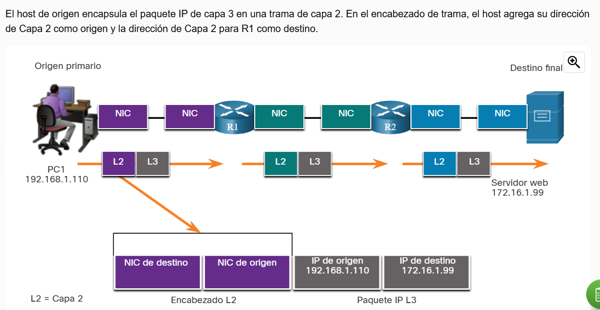
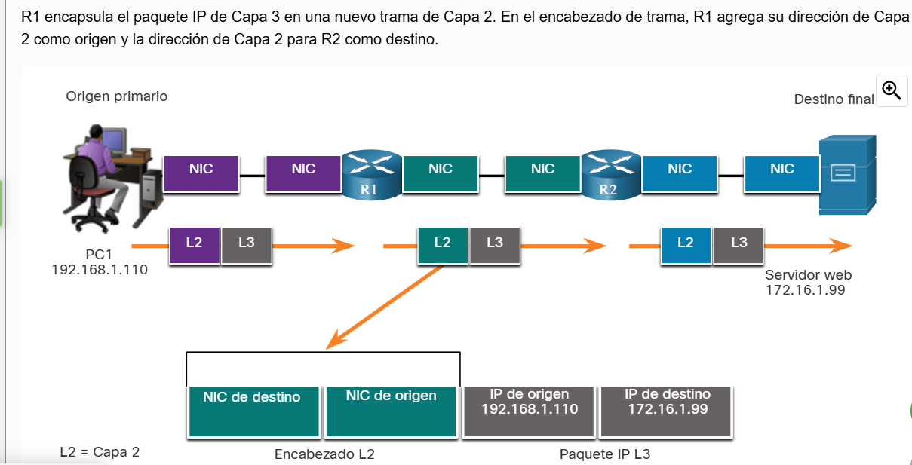
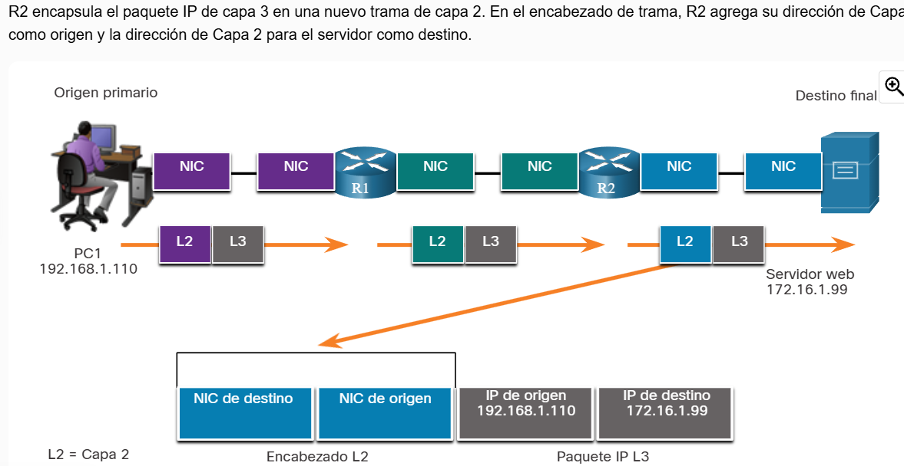

# Redes

## recapitulación:

### módulo 5:
ipv4 son direcciones de 32 bits(4 octetos), se muestran en binario pero regularmente las vemos en decimal como por ejemplo 192.168.10.10 (poner valor en binario), mientras que las ipv6 son de 128 bits, representadas en hexadecimal.

direcciones ipv4 y binarios

para que un router pueda comunicar 2 dispositivos/redes deben de ser diferentes

Como en ese ejemplo, el router comunica a 2 redes con distintas ip, en este caso con el tercer octeto diferente

o en este, que comunica a 3 redes con una diferencia antes del ::64

ipv6 se maneja en hextetos(16) de bits, representados en hexadecimal

### módulo 6

#### capa de transporte (capa 4)
Se encarga de segmentar la información, por medio de 2 posibles protocolos: udp(cada segmento se le llama datagrama) y tcp(? (a cada parte se le llama segmento).

**protocolo TCP**  
El protocolo de control de transporte, orientado a la transmisión, consta de 3 partes. Puede haber retransmisiones, por si llega mal al destino, lo que hace que sea confiable hasta este protocolo. Les otorga un número de secuencia, lo que permite que aunque cada segmento se llegase a mandar en desorden, en el destino se reordena (igual en capa 4). También si llega dañado un segmento, se solicita que se reenvíe únicamente el necesario.

**protocolo udp**

#### capa de red (capa 3)
Única capa en la que se le llaman paquetes a la información, los routers trabajan con IP’s, se encarga de asignarle al paquete la ip a la que se destina y de la cual viene.

#### capa de enlace de datos (capa 2)
Su propósito es enlazar las direcciones MAC, que son direcciones únicas de una tarjeta de red, así sean del mismo modelo la dirección es única. La información en esta capa (CAPA 2) son llamados TRAMA. Esta capa es la responsable de comunicar entre tarjetas de interfaz de red (NIC).  
Permite que tramas superiores accedan a los medios  
Acepta los datos de la capa 3(ipv4 o 6) y los encapsula en tramas  
Controla cómo se intercambian, colocan y reciben.  
Recibe datos  
Realiza detección de errores y rechaza tramas dañadas  

Si por alguna razón no conoce la MAC adress de destino, con el protocolo ADP, donde el router le pregunta a todos los dispositivos quien es con el que se quiere comunicar, que se identifique con su MAC adress.

Esta capa prepara los datos de red para la red física, necesita saber cómo está conectada la capa física desde antes de prepararlos
##### Provisión de acceso a los medios
Cada entorno de red que los paquetes encuentran cuando viajan desde un host local hasta un host remoto puede tener características diferentes. Por ejemplo, una LAN Ethernet generalmente consta de muchos hosts que compiten por el acceso en el medio de red. La subcapa MAC resuelve esto. Con los enlaces serie, el método de acceso sólo puede consistir en una conexión directa entre solo dos dispositivos, generalmente dos routers. Por lo tanto, no requieren las técnicas empleadas por la subcapa MAC IEEE 802.

Las interfaces del router encapsulan el paquete en la trama apropiada. Se utiliza un método adecuado de control de acceso a los medios para acceder a cada enlace. En cualquier intercambio de paquetes de capas de red, puede haber muchas transiciones de medios y capa de enlace de datos.

En cada salto a lo largo de la ruta, un router realiza las siguientes funciones de Capa 2:

1. Aceptan una trama proveniente de un medio.
2. Desencapsulan la trama.
3. Vuelven a encapsular el paquete en una trama nueva.
4. Reenvían la nueva trama adecuada al medio de ese segmento de la red física.

# completar hasta el 6.2
#### topologias
topologia fisica: identifica las conexiones fisicas que interconectan n cantidad de dispositivos. 
 
topologia logica: tambien conocido como direccionamiento logico, es la forma en la que una red transfiere tramas al nodo siguiente, identifica las conexiones virtuales mediante interfaces de dispositivo mediante esquemas de direccionamiento IP de capa 3. 

##### topologias WAN
forma de conectar multiples conexiones LAN, una o muchas redes locales. Por ejemplo, toda la instalacion del tecnologico de morelia es una red local, toda la forma en la que se distribuyen sus redes es local, y si quisiera establecer 

offtopic(?): las VPN[Virtual Private Network] nos aseguran las redes e info encriptando, es como un tunel entre redes a traves de la nube, aunque alguien capture en medio del viaje, no sabe que dice. De esta forma se puede conectar de forma segura 2 LAN(UNA WAN) "sin necesidad de un provedor"(suponiendo que fuere viable hacer la instalacion en largas distancia)

existen varias formas de hacer estas conexiones:
- punto a punto: dos dispositivos directamente
- estrella: muchos dispositivos interconectados por medio de uno central
- malla: todos conectados con todos, la mas optima pero mas costosa 

##### topologias LAN

##### Comunicacion FullDuplex y HalfDuplex
###### verificar que nuestra tarjeta de red no esté en halfDuplex, productor de posible lentitud
para hacer eso, tenemos que seguir la siguiente ruta:

y en las opciones de la izquierda

en este caso, hay que procurar que la tarjeta siempre este configurada siempre en autonegociacion, pues si está fija en uno aunque sea full duplex, haria incompatible la comunicacion
#### metodos de control de acceso
##### acceso basado en la contencion
en estas redes todos los dispositivos/nodos operan en semiduplex, compitiendo por quien usa el medio. solo hay un proceso si mas de un dispositivo tranmite al mismo tiepo

##### acceso controlado

#### acceso por contencion

HUB: miniswitch, que en realidad es el switch antiguo. Es un repetidor de bits, es decir que lo que entraba por uno de sus lados se reenviaba a todos los demás, por eso en el se usaban los metodos de control donde solo uno mandaba. Con este se hacian las redes antiguas

### trama de enlace de datos
la trama de enlace de datos prepara los datos encapsulados(capa 2, MAC ADDRESS)
consta de 3 partes
- encabezado
- datos 
- trailer
esta trama cambia segun el destino, es decir que debe de estar preparada segun el destino y el camino. Por ejemplo, de la computadora al router lo mandamos de manera inalambrica, los datos se preparan para mandarse asi; pero en el camino entre router y router se comunica por cable de fibra optica, de ahi a uno de cable, otro de fibra y asi por n cantidad de caminos que puede ir cambiando la trama dependiendo del medio por el que se vaya a transportar 
#### campos de trama 

#### Direcciones de capa 2
host a router

router a router

router a host

**COMPLETAR**
existen puertos de origen (desde el 1024, que antes de eso la pc los destina a otra cosa) y de destino (como los sitios web, que si es http es 80 o https 443)

los switches guardan las MAC en su tabla de MAC ADRESS

ARP es un protocolo para comunicarse con MAC adress que aunque desconocida, el switch le "pregunta" al resto de los dispositivos quien tiene la ip solicitada, quien la tiene se la proporciona al switch y este facilita la comunicacion. A partir de ahi, el switch almacena la MAC adress que está conectada en el puerto del dispositivo que respondió su MAC ADRESS. Este tipo de comunicacion es por origen

-----

aqui podemos apreciar una red, donde el cable azul es un cable de consola

**nota: como en el caso de 10.10.10.2/24, el /24 nos dice antes de empezar esos numeros los 24 bits anteriores a la dicha son los de la red, osea que son 255.255.255, es una nomenclatura para ahorrar espacio**

podemos apreciar la DEFAULT GATEWAY es la ip que nos asigna el router a todos los dispositivos para comunicarnos con otros dispositivos ajenos a la misma red, por lo que es la que usan nuestros dispositivos para internet, en este caso (regresando a la imagen de la red) del router a la izquierda tienen la DEFAULT GATEWAY 10.10.10.1/24, que  es con la que se comunican a la red de la derecha, con DEFAULT GATEWAY 20.20.20.20.1/24

#### como comunicar la PC1 con la PC0

nos dice que en la capa 3, la pc1 lo que sabe. src(origen): la ip de la computadora que manda el ping

**nota:3 tipos de mensaje en telecom:**

**- unicast**

**- broadcast**

**- completar**

podemos apreciar lo primero que pasa cuando se intenta hacer comunicacion entre 2 dispositivos dentro de la misma red y que nunca antes se ha hecho(el switch y la pc1 desconocen la MAC Adress de la PC0), ahi en la capa 2 como no sabe HACE EL PROTOCOLO ARP, para conocer la MAC Adress. primero hace todo el protocolo antes de tirar el ping

aqui podemos ver que despues de ejecutar la primera parte de arp, el paquete avanzó al switch 0 y como el paquete avanzó de origen pc1 al switch, el switch ya conoce la MAC ADRESS de la pc1, pero le falta preguntar a los dispositivos que no son PC1 de quien tiene la mac address de la ip a la que la pc1 se quiere comunicar(tirar ping/simple package). Como en este caso aun no esta configurada la conexion del router a la red de la izquierda, solo tiene un dispositivo al que preguntarle, al router de la derecha

de hecho, como se ve en esta imagen, si le preguntamos a la pc0 cuales mac adress conoce, no conoce ninguna, pues nunca se ha comunicado con el switch, por lo tanto tampoco con la pc1

en el siguiente paso, el paquete llega al pc0

COMPLETAR

----
configurando router o para que establezca conexion, asignandole una ip al switch que tiene conectado por el puerto gigabit0/1

y los leds de la izquierda se prenden

y se hace lo mismo con la interface de la derecha, que es la interface gigabitEthernet 0/1 del router

ahora, configuramos la VirtualLan del switch desde la pc 1(aprovechando que lo conectamos por el cable de consola)

en la siguiente imagen, previamente conectamos la computadora con el router y le configuramos password en el login y enable al switch, pero ademas nos permitira conectarnos de la pc al router sin necesidad de que se conecte directamente con cable de consola

ahora, con el cable desconectado y siguiendo la ruta (en la pc) de desktop>SSH/TELNET>TELNET y en telnet escribimos la ip a la que nos queremos comunicar, en este caso 10.10.10.1, que nos dirigue al router.

y apreciamos, que nos dejo acceder al router desde la pc0 sin necesidad de tener conectado un cable consola

-----

el router aprende IP's en la tabla de routeo, cuando se le asigna una ip a alguna de sus interfaces y encendemos la intefaz las almacena en dichas tablas. Si apagamos la interfaz, el router deja de conocer dicha ip

-----
### continuacion trama de enlace de datos
aqui vemos una tabla de rutas, que es como se decide por donde mandar paquetes. podemos ver que hay multiples opciones, donde la mas rapida es la primera, pues su metrica de `costo` es la menor. Sirve como una puerta de emergencia, si algun router no conoce la ruta para mandar el paquete, manda el paquete al siguiente router para ver si el siguiente si sabe como hacerlo, y lo manda por esa ruta; actua como una salida de emergencia. Cabe recalcar que el tiempo que queda bailando el paquete en busqueda de quien sepa enviarlo tiene limite.

### Tramas LAN y WAN
tradicionalmente los wan utilizaban otros tipos de protocolos para varios tipos de topologias punto a punto, hub-spoke y malla completa. Algunos de los mas comunes al pasar de los años son
- protocolo punto a punto (PPP)
- control de enlace de datos de alto nivel (HDLC, High-level Data link Control)
- Frame Relay
- Modo de Transferencia Asincrona (ATM)
- X.25(se usaba para puntos de venta/terminales, pero ya está casi totalmente en desuso)

por defecto, los equipos cisco hablan/trabajan en el protocolo WAN HDLC

`nota: en un router por defecto sus puertos están apagados, en cambio un switch por defecto en cuanto se conectan están encedidos/funcionando`

## Ethernet switching
la capa 2 se subdivide en 2 capas, la "superior" LLC(control de enlace logico 802.2) es la encargada de ver con que operarémos en la capa fisica y la subcapa MAC, que es la de Control de Acceso al Medio. El estándar de ethernet es el 802.3.
`nota: el estandar de wifi es 802.11`
### campos de la trama internet

## comunicaciones unicast

## comunicaciones broadcast
para identificar un mensaje broadcast, la direccion mac de destino es FF-FF-FF-FF(o 255.555.255.255 si fuere en capa 2)

## comunicaciones multicast
comunicaciones de un segmento del todo, es decir. Dentro del universo de todos los dispositivos, a un segmento. Hay rangos de direcciones, y una la clase D es reservada para multicast, nosotros no podemos trabajar con ella

### clases de IP Adress

como vemos en la imagen, los unicos bits modificables son los de host en la clase C(como las domesticas), eso nos da 256 posibles direcciones (que en realidad no se pueden usar ni la primera ni la ultima, pues es donde inicia y finaliza la red).

#### private Adress Space
dentro de una clase, hay un rango de ip's privadas, como las que usamos en nuestras redes para comunicarnos entre dispositivios de la misma red

nuestro router en casa, lo que hace es nateo, proceso que veremos después, pero basicamente por una metodologia transforma nuestra red privada en una publica
 
# estudiar 7.3.6

### Metodos de reenvío de tramas
Con los switches Cisco, en realidad hay dos métodos de reenvío de tramas y hay buenas razones para usar uno en lugar del otro, dependiendo de la situación.

Los switches utilizan uno de los siguientes métodos de reenvío para el switching de datos entre puertos de la red:

    Switching de almacenamiento y envío - Este método de reenvío de trama recibe la trama completa y calcula el CRC(codigo de redundancia ciclico, verifica si lo llegado y lo recibido coincide, entonces le pide al origen la retransmisión de la trama).

### subneteo
Mascara de subred de direccion variable. Es hacer de una red mas grande, varias mas chicas de acuerdo a las necesidades. Como podemos apreciar en la siguiente imagen, aunque la ipAdress es de clase A, la mascara se comporta como una de clase B

Eso es lo que hacemos con el subneteo, manipular las mascaras

Para resolver una necesidad de host (numero de host que queremos) tenemos que empezar a contar desde el extremo derecho, el bit 32; por ejemplo, si nos piden 14 host en una red tipo c, los ultimos 4 bits del ultimo octeto nos cubren la necesidad a la perfeccion, pues nos da los 14 host y el bit inicial y final que no son usables, no quedan bits volando, y para resolver la necesidad de host(nos pidieron en el ejemplo 14 subredes usables) tenemos que fijarnos donde nos indica la mascara que nos posicionemos, en este caso la mascara al ser red tipo c es 255.255.255.0, con lo que tenemos posicionarnos en el primer bit del ultimo octeto de la mascara, y de izquierda a derecha veremos que el numero que mas se acerca es el 16, que es el que nos cubre a la perfeccion la necesidad de 14 subredes. Pues son los 14 usables + 2 que de inicio a fin que no se pueden usar. En este ejemplo por conveniencia no sobraron bits volando, pero de haber sido el caso, no pueden quedar bits volando.

terminando de resolver, nos queda lo siguiente:
- total de subredes: 16
- total de subredes usables: 14
- total de hosts= 16
- total de hosts usables=14
- bits robados= 4
`porque bits robados?` la mascara de la red(el tipo de red 'C') nos indicaba que el unico octeto que no le pertenecia al host era el ultimo, los 8 ultimos bits no le pertenecian a los host, eran de las redes que el tipo de red nos permitia modificar para el host, pero al subnetear le cedemos los bits a la red, se los ROBAMOS al host para darselos a las redes, por eso en este caso fueron 4 robados, que son los 4 que necesitamos para asignarlos al host.

Cuando nos presentan un problema donde las subredes presentan necesidades de host distintas, comenzaremos a resolver para la red que tenga la necesidad más grande  y de ahí hacia abajo. porque? para empezar, a lapiz nos complica los calculos, pero mas importante, imposibilita la capacidad de comunicarse entre ip's.s

Igualmente, si un dia despues de subnetear, una red necesita mas host, simplemente modificando la mascara de esa red ampliamos la capacidad.

#### NAT
En nuestros hogares tenemos redes privadas, que son validas son lo dentro de nuestra red. Por ejemplo, si nos comunicamos con gmail, podemos comunicarnos hacia ellos pero de regreso no puede comunicarse, pues es privada. Es `lo que soluciona la NAT`, antes de enviar el paquete de informacion, la desencapsula y le desasocia la red privada, asociandole una publica y la envia, y de regreso le vuelve a asignar la privada. Es decir, en una comunicacion bilateral se necesita `NATEAR` 2 veces. 

Evidentemente es necesario esto, pues todos tenemos ip's privadas, no es posible tener una ip publica. Cada continente tiene un rango de ip's publicas, y cada pais sus propias. Cada pais las reparte entre sus provedores de servicios.ks
## IPV6
### LIMITACIONES IPV4
- agotamiento de direcciones ipv4, al manejarse en decimal son mas limitadas
- falta de conectividad extremo a extremo.
- mayor complejidad en la red
### Generalidades de ipv6
- manejo de paquetes mejorado: se maneja con 128 bits, a diferencia de los 32 bits
- elimina la necesidad del NATEO, pues al ser tan amplia la cantidad de direcciones de ipv6 no se repiten. Aunque por parte de accesibilidad de internet está mejor, por parte de seguridad no es tan recomendable manejarlo asi.

#### encabezados IPV4

considerando que esos 20 bytes los agrega el protocolo TCP en el encabezado
#### encabezados IPV6

### DECISIONES DE REENVIO DE HOST
los paquetes siempre se crean en el host de origen. El host de origen debe poder dirigir el paquete al host de destino. Para ello, los dispositivos finales de host crean su propia tabla de enrutamiento. En este tema se explica cómo los dispositivos finales utilizan las tablas de enrutamiento.

Otra función de la capa de red es dirigir los paquetes entre hosts. Un host puede enviar un paquete a lo siguiente:

- Itself - un host puede hacer ping a sí mismo enviando un paquete a una dirección IPv4 especial de 127.0.0.1 o una dirección IPv6 ::1, que se conoce como la interfaz de bucle invertido. El hacer ping a la interfaz de bucle invertido, pone a prueba la pila del protocolo TCP/IP en el host.
- Host local - este es un host de destino que se encuentra en la misma red local que el host emisor. Los hosts de origen y destino comparten la misma dirección de red.
- Host remoto - este es un host de destino en una red remota. Los hosts de origen y destino no comparten la misma dirección de red.

Cuando enviamos un paquete, detecta la computadora si es una direccion dentro de la misma red, en caso de no ser de la misma lo manda al router, y este a través de su tabla de routeo sabe como llegar al destino
### PUERTA DE ENLACE PREDETERMINADA
La puerta de enlace predeterminada es el dispositivo de red (es decir, el router o el switch de capa 3) que puede enrutar el tráfico a otras redes. Si se piensa en una red como si fuera una habitación, el gateway predeterminado es como la puerta. Si desea ingresar a otra habitación o red, debe encontrar la puerta.

En una red, una puerta de enlace predeterminada suele ser un router con estas características:

- Tiene una dirección IP local en el mismo rango de direcciones que otros hosts en la red local.
- Puede aceptar datos en la red local y reenviar datos fuera de la red local.
- Enruta el tráfico a otras redes.

### Decisión de envio de paquetes del router
¿Qué sucede cuando llega un paquete a la interfaz de un router?

El router examina la dirección IP de destino del paquete y busca en su tabla de enrutamiento para determinar dónde reenviar el paquete. La tabla de enrutamiento contiene una lista de todas las direcciones de red conocidas (prefijos) y a dónde reenviar el paquete. Estas entradas se conocen como entradas de ruta o rutas. El router reenviará el paquete utilizando la mejor entrada de ruta que coincida (más larga).

### tabla de enrutamiento ip router
La tabla de enrutamiento del router contiene entradas de ruta de red que enumeran todos los posibles destinos de red conocidos.

La tabla de enrutamiento almacena tres tipos de entradas de ruta:

- Redes conectadas directamente - estas entradas de ruta de red son interfaces de router activas. Los routers agregan una ruta conectada directamente cuando una interfaz se configura con una dirección IP y se activa. Cada interfaz de router está conectada a un segmento de red diferente. En la figura, las redes conectadas directamente en la tabla de enrutamiento IPv4 R1 serían 192.168.10.0/24 y 209.165.200.224/30.
- Redes remotas - estas entradas de ruta de red están conectadas a otros routers. Los routers aprenden acerca de las redes remotas ya sea mediante la configuración explícita de un administrador o mediante el intercambio de información de ruta mediante un protocolo de enrutamiento dinámico. En la figura, la red remota en la tabla de enrutamiento IPv4 R1 sería 10.1.1.0/24.
- Ruta predeterminada - al igual que un host, la mayoría de los routers también incluyen una entrada de ruta predeterminada, una puerta de enlace de último recurso. La ruta predeterminada se utiliza cuando no hay una mejor coincidencia (más larga) en la tabla de enrutamiento IP. En la figura, la tabla de enrutamiento IPv4 R1 probablemente incluiría una ruta predeterminada para reenviar todos los paquetes al router R2.

La figura identifica las redes directamente conectadas y remotas del router R1.
#### enrutameinto estatico
entradas de ruta que se configuran manualmente, por tenerlo directamente conectado. Si queremos conectar a una red que no tenemos conectado, routear de manera estatica es ir indicando los saltos que queremos que de entre dispositivos, pero si nos equivocamos el router hace de todos modos el salto, sin importar si está bien o mal, o si llega a fallar la ruta. 

#### enrutamiento dinamico
Un protocolo de enrutamiento dinámico permite a los routers aprender automáticamente sobre redes remotas, incluida una ruta predeterminada, de otros routers. Los routers que usan protocolos de enrutamiento dinámico comparten automáticamente la información de enrutamiento con otros routers y compensan cualquier cambio de topología sin que sea necesaria la participación del administrador de la red. Si se produce un cambio en la topología de red, los routers comparten esta información mediante el protocolo de enrutamiento dinámico y actualizan automáticamente sus tablas de enrutamiento.

es decir, marcamos que habrá un enrutamiento dinamico y entre routers se avisan que rutas conocen ellos, se las dicen entre ellos y con eso se apoyan constantemente para mandar las cosas. Si falla algun camino, en automatico la ruta se acomoda.

El comando show ip route de EXEC mode privilegiado se utiliza para ver la tabla de enrutamiento IPv4 en un router Cisco IOS. El ejemplo muestra la tabla de enrutamiento IPv4 del router R1. Al principio de cada entrada de tabla de enrutamiento hay un código que se utiliza para identificar el tipo de ruta o cómo se aprendió la ruta. Entre las fuentes de ruta comunes (códigos) se incluyen las siguientes:

L - Dirección IP de interfaz local conectada directamente

C - Red conectada directamente

S — La ruta estática fue configurada manualmente por un administrador

O - OSPF

D - EIGRP

## Resolucion de direcciones
Hay dos direcciones primarias asignadas a un dispositivo en una LAN Ethernet:

- Dirección física (la dirección MAC) - Se utiliza para comunicaciones NIC a NIC en la misma red Ethernet.
- Dirección lógica (la dirección IP) - Se utiliza para enviar el paquete desde el dispositivo de origen al dispositivo de destino. La dirección IP de destino puede estar en la misma red IP que la de origen o en una red remota.

es decir, las capa 2 son las MAC. Todos los paquetes enviados necesitan mac de origen destino y ip de origen destino
### destino en una red remota
cuando la ip destino está en una red remota, la direccion mac de destino será la del gateway predeterminada del host(interfaz del router), es decir, la mac es valida dentro de la misma red (los conectados al mismo router). 

---

protocolo orientado a la conexion(TCP): que antes de hacer intercambio de conexion, el remitente le pregunta al destinatario si está listo para recibirlo

protocolo no orientado a la conexion(UDP): no pregunta si está orientado

la diferencia de TCP/IP y tcp, es que tcp opera en la capa de transporte y tpc/ip opera en la capa de red

----

### mensajes ICMPV6 de solicitud y de anuncio de router
ICMPv6 incluye cuatro nuevos protocolos como parte del protocolo ND o NDP(Neighbor Descovery Protocol):
- Mensaje de solicitud de router
- Mensaje de anuncio de router
- Mensaje de solicitud de vecino
- Mensaje de anuncio de vecino

### Traceroute. prueba de la ruta
Traceroute(tracert)
Genera una lista de saltos que se alcanzaron correctamente a lo largo de la ruta, contrario de un ping simple que unicamente dice si llega o no, sin importar por donde llega o hasta donde se quedó.

## vlan
red de area local virtual, son segmentaciones logicas de una red. Por ejemplo, cuando tenemos 3 computadoras conectadas a un switch, las 3 estan conectadas al mismo switch, entonces en capa 2 (mac address) solo existe 1 red, y vlan a nivel logico divide esta red