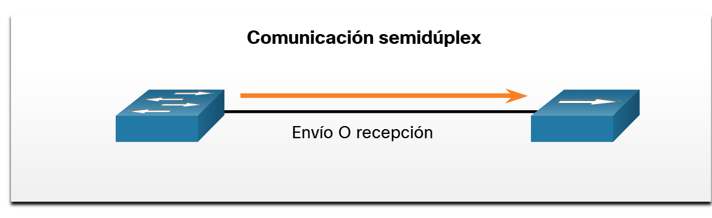
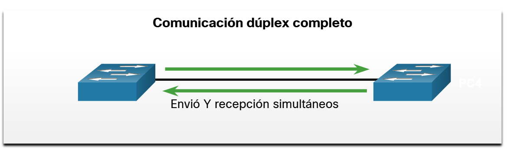
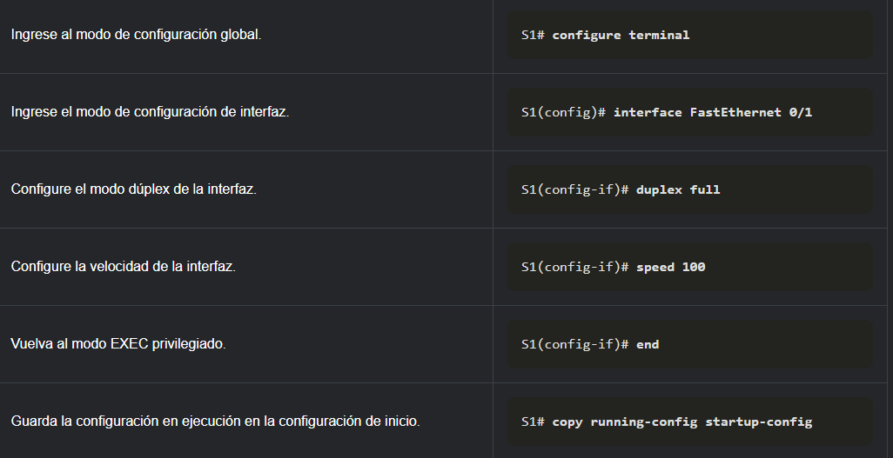
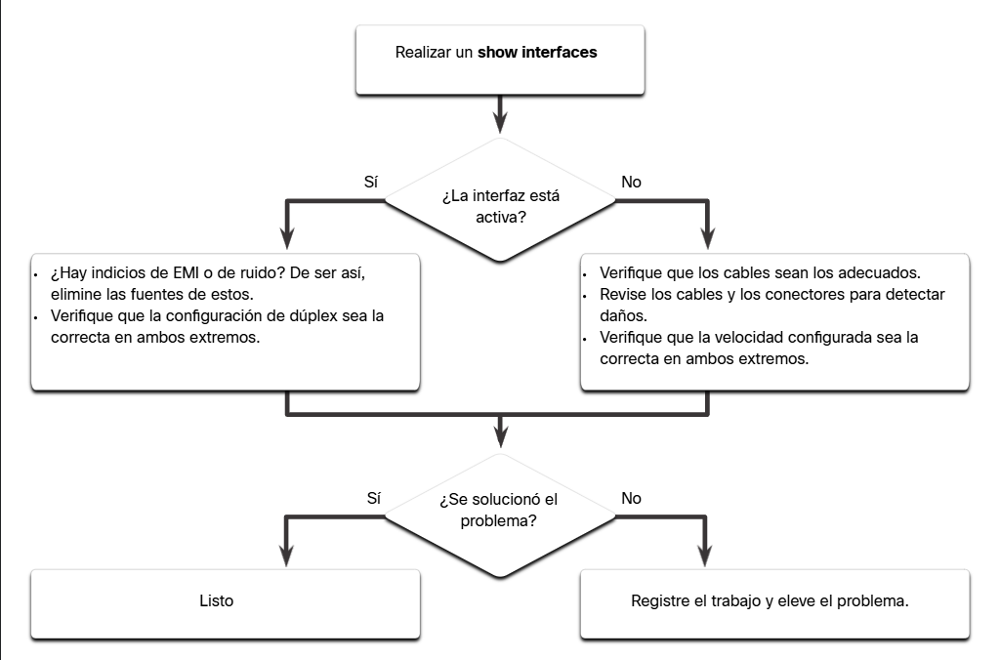
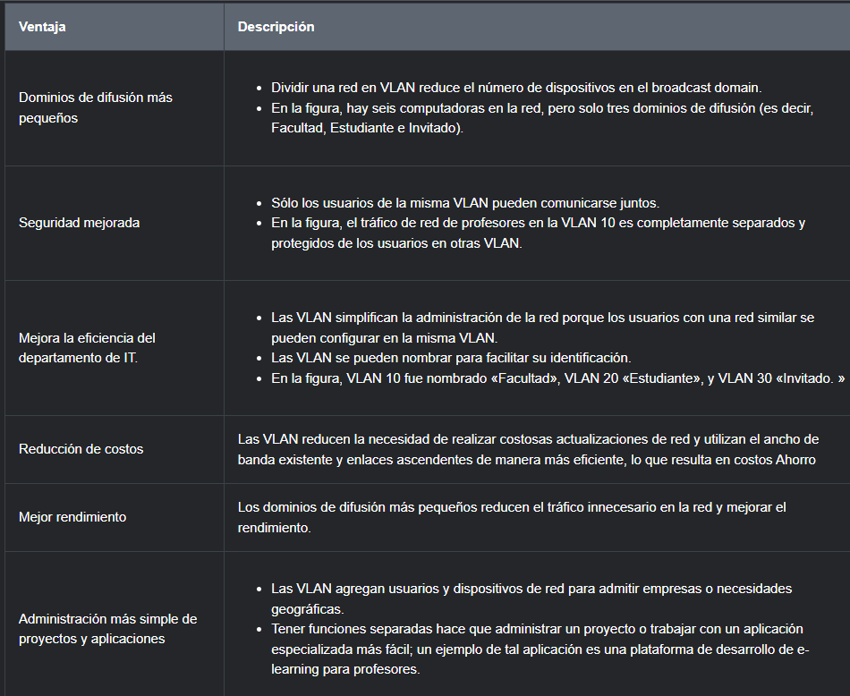
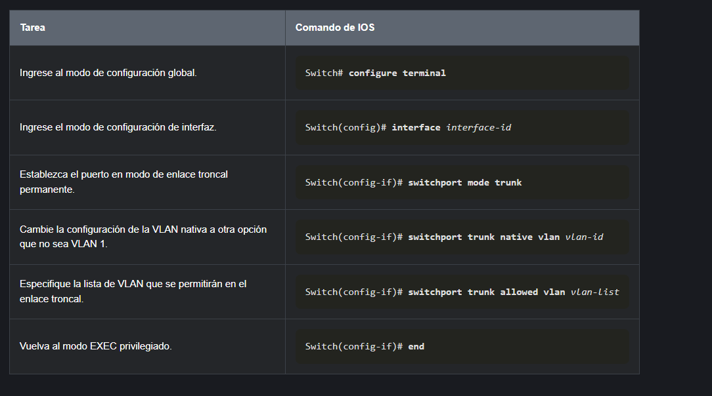

# Conmutacion y enrutamiento en redes de datos

# recordar
entre switches se conectam con cables de comunicacion cruzada

## configuracion basica (puertos switch?)

Para armar una red se necesita minimo un switch y un dispositivo de extremp(como pc). Si pongo 20 switches interconectados estos podrian formar parte de la misma red, mientras tengan direccionamientos de la misma red estos dispositivos podrán comunicarse. Las VLan sirven para dividir una red en varias, que aunque fisicamente responden al mismo dispositvo son diferentes redes.

si tenemos 2 vlan, los dispositivos de extremo de la vlan1 no se pueden conectar con los de la vlan2.
```
conf t
vlan99
do sh vlan
name admon
ip address 172.16.99.1 255.255.255.0
no shut(comprobar)

//ahora configuramos la interfaz deseada como de administracion el modo de acceso
interface f0/23
switchport mode acces
switchport acces vlan99
```

el proposito de esta vlan99 es tener una vlan para administrar el resto, aunque en realidad puede ser cualquiera entre la vlan2 y vlan1001.
```
show interface brief
do show runnin config
```
ahora, si queremos conectarnos a la vlan, nos vamos al switch donde la configuramos, al puerto 23 que es el que pusimos en **modo de acceso**(para una sola vlan, a diferencia de las **troncales** ) 

tenemos que preparar lineas vty, lineas de consola y una contraseña para el modo privilegiado

```
//en lugar de enable password, para que vaya cifrado
enable secret class
line vty7
//para a esa linea ponerle limite de 4 usuarios por linea vty simultaneos, pues al ser de configuracion no necesita ni es conveniente que haya muchos
line vty 0 4 
password cisco
```

ahora si accedemos desde el putty por telnet, nos pide la contraseña

resumidamente, se necesita que: 
- la vlan que se designará de administración tenga ip
- en todas los switches de la topoligia tendremos que añadir esta misma vlan(con diferente ip) para poder administrar cada uno de ellos dependiendo la IP

## comunicacion de puertos de un switch
### duplex 
es comunicacion en ambos sentidos
#### duplex completo
envio y recepcion simulteaneo de datos


#### semiduplex
envio o recepcion, turnado

para configurarlos puertos del switch de esta manera son los siguientes comandos

### Modo MDIX Automatico
los switches transmiten a traves del par conectado al pin 3 y 6 del cable utp, del otro lado 1 y 2 y ahi ya se pueden comunicar. Esto antes si era util, hoy dia en defecto es automatico y así sirve. Tambien existe el dinamico deseable, pero el DINAMICO AUTOMATICO es el POR DEFECTO y asi sirve
```
mdix auto
```
### problemas capa de acceso a la red
con show interfaces podemos ver los problemas comunes de medios o **ip interface brief**, este ultimo nos ayuda a ver si están levantadas o no. De hecho salen 2 columnas, la primera nos muestra si lo fisico(capa fisica) está levantado y la segunda si el protocolo(capa de enlace de datos) está levantado, como una guia mas precisa. Ambos obviamente son obligatorios para la configuracion


comando para muchos datos
```
show interfaces fastEthernet 0/18
```
aqui ademas de ver a que vlan pertenecen, podemos ver si existen coliciones. Los paquetes son de 1512bites, cuando existen coliciones(2 paquetes enviados de distintos lados chocan) pueden perderse, si sobreviven mas de 66bites pueden ser parcialmente legibles, si son menos se consideran **RUNTS**, algo inservible

CRC es un protocolo para verificar la integridad de la informacion

```
FastEthernet0/18 is up, line protocol is up (connected)
  Hardware is Fast Ethernet, address is 0025.83e6.9092 (bia 0025.83e6.9092)
  MTU 1500 bytes, BW 100000 Kbit/sec, DLY 100 usec,
     reliability 255/255, txload 1/255, rxload 1/255
  Encapsulation ARPA, loopback not set
  Keepalive set (10 sec)
  Full-duplex, 100Mb/s, media type is 10/100BaseTX
  input flow-control is off, output flow-control is unsupported
  ARP type: ARPA, ARP Timeout 04:00:00
  Last input never, output 00:00:01, output hang never
  Last clearing of "show interface" counters never
  Input queue: 0/75/0/0 (size/max/drops/flushes); Total output drops: 0
  Queueing strategy: fifo
  Output queue: 0/40 (size/max)
  5 minute input rate 0 bits/sec, 0 packets/sec
  5 minute output rate 0 bits/sec, 0 packets/sec
     2295197 packets input, 305539992 bytes, 0 no buffer
     Received 1925500 broadcasts (74 multicasts)
     0 runts, 0 giants, 0 throttles
     3 input errors, 3 CRC, 0 frame, 0 overrun, 0 ignored
     0 watchdog, 74 multicast, 0 pause input
     0 input packets with dribble condition detected
     3594664 packets output, 436549843 bytes, 0 underruns
     8 output errors, 0 collisions, 10 interface resets
     0 unknown protocol drops
     0 babbles, 235 late collision, 0 deferred
```
### resolucion de problemas de la capa de acceso a la red


### config ssh

los usuarios ssh se guardan localmente en el dispositivo que lo configuremos

```
S1(config)# ip domain-name cisco.com
//tamaño encriptacion
S1(config)# crypto key generate rsa
How many bits in the modulus [512]: 1024
S1(config)# username admin secret ccna
S1(config)# line vty 0 15
S1(config-line)# transport input ssh
S1(config-line)# login local
S1(config-line)# salida
```

### interfaces loopback
existe en todos los routers, es una interfaz logica(no fisica). Su utilidad es comprobar las 4 fases del protocolo de comunicacion tcp/ip

## reenvio de tramas
### switching en la red
si por ejemplo, tenemos 2 switches interconectados, un switch en su tabla de macs registra todas las que tiene conectadas el otro, de modo que en su mismo puerto tiene varias macs asociadas

### El método Aprender y Reenviar del Switch

1. Aprender - Examinando la dirección Origen MAC
   - Se revisa cada trama que ingresa a un switch para obtener información nueva. Esto se realiza examinando la dirección MAC de origen de la trama y el número de puerto por el que ingresó al switch.

   - Si la dirección MAC de origen no existe en la tabla de direcciones MAC, la dirección MAC y el número de puerto entrante son agregados a la tabla.
   - Si la dirección MAC de origen existe, el switch actualiza el temporizador para esa entrada. De manera predeterminada, la mayoría de los switches Ethernet guardan una entrada en la tabla durante cinco minutos. Si la dirección MAC de origen existe en la tabla, pero en un puerto diferente, el switch la trata como una entrada nueva. La entrada se reemplaza con la misma dirección MAC, pero con el número de puerto más actual.
2. Reenviar - Examinadno la dirección destino MAC
   - Si la dirección MAC de destino es una dirección de unidifusión, el switch busca una coincidencia entre la dirección MAC de destino de la trama y una entrada de la tabla de direcciones MAC:

      - Si la dirección MAC de destino está en la tabla, reenviará la trama por el puerto especificado.
      - Si la dirección MAC de destino no está en la tabla, el switch reenviará la trama por todos los puertos, excepto por el de entrada. Esto se conoce como unidifusión desconocida. Si la dirección MAC de destino es de difusión o de multidifusión, la trama también se envía por todos los puertos, excepto por el de entrada.

**estudiar CRC** 

**estudiar del 2.5 al 3.1.2**
## VLAN
las vlan entre la 1 y la 1005 son vlans de rango normal, despues de eso hasta el 4093 son de rango ampliado. La sugerencia es no usar entre las 1002 y la 1005, pues son diseñadas para tecnologias viejas.

configurar una vlan
```
conf t
vlan99       //numero que le querramos poner
do sh vlan
name almacen
ip address 172.16.99.1 255.255.255.0


//ahora configuramos las interfaces que querramos que pertenezcan a esa vlan

interface range f0/2-3
switchport mode acces  //para que pertenezca a una sola vlan


//verificamos

do sh interface fa0/1 switchport
do sh interface fa0/2 switchport

//y lo que configuramos es el administrative mode, que en el 1 viene por defecto y en el 2-3 viene como estatico

interface f0/2
switchport access vlan23
interface f0/3
switchport access vlan23

//estos son para cambiar las interfaces de vlan
```

la recomendacion es no dejar interfaces en la vlan default, aunque no se vayan a ocupar. La podemos dejar en una vlan extra llamada vlan de **AGUJERO NEGRO**

y si queremos comunicarnos entre switches, a ambos switches se les deben de configurar las vlan, caso contrario solo se pueden comunicar con los puertos de la vlan default y conectar la pc del switch2 a un puerto que pertenezca a la 23, y entre switches estar conectados a puertos/interfaces de la vlan 23

si entre switches hay que comunicar mas de una vlan, se puede o poner otro cable interconecatandolos y los puertos de este cable ponerlos en esta nueva vlan, o podemos hacer un solo enlace que comunique a ambas con el **modo troncal** en vez de modo de acceso. Preferentemente los 2 puertos de interconexion deben de estar en modo troncal, pero puede estar uno troncal y otro dinamico. Si estan en modos acceso-troncal, aunque el paquete puede llegar no es capaz de entenderlo.

Lo recomedndado es hacerlo con el modo troncal siempre, pues los puertos en la vida laboral son limitados, aunque  en dispositivos finales es mejor modo de acceso

Si se mandan mensajes de broadcast con vlans, se transmiten solo con los de la misma vlan. A eso se le llama ajuste de difusion


### tipos de vlan

**vlan 1 "default"**, por defecto tiene todos los puertos
Entre los datos importantes que hay que recordar acerca de la VLAN 1 se incluyen los siguientes:

- Todos los puertos se asignan a la VLAN 1 de manera predeterminada.
- De manera predeterminada, la VLAN nativa es la VLAN 1.
- De manera predeterminada, la VLAN de administración es la VLAN 1.
- No es posible eliminar ni cambiar el nombre de VLAN 1.

**vlan de datos** Las VLAN de datos son VLAN configuradas para separar el tráfico generado por el usuario. Las VLAN de datos se usan para dividir la red en grupos de usuarios o dispositivos. Una red moderna tendría muchas VLAN de datos en función de los requisitos organizativos. Tenga en cuenta que no se debe permitir el tráfico de administración de voz y red en las VLAN de datos.

**vlan nativa** una vlan que configuramos para que en las tramas no se etiqueten con el numero de vlan que van, para evitar ataques a la red como el de doble etiqueta, se recomienda que esta sea unicamente la vlan de administracion. Entre los puertos del switch troncales, pedirle que trate a la de admin como administrativa

**vlan de administracion** Una VLAN de administración es una VLAN de datos configurada específicamente para el tráfico de administración de red, incluyendo SSH, Telnet, HTTPS, HHTP y SNMP. De forma predeterminada, la VLAN 1 se configura como la VLAN de administración en un conmutador de capa 2. 

#### configurar puertos ocmo troncales


de los 16 bits de una trama(?)m 12 son para identificar la vlan y los ultimos 4, el primero es para un protocolo que ya no existe


ver caracteristicas un puerto

```
sh interface f0/0 switchport
```

sh int trunk native vlan '#vlan'

```
S1(config)# interface fastEthernet 0/1
S1(config-if)# switchport mode trunk
S1(config-if)# switchport trunk native vlan 99
S1(config-if)# switchport trunk allowed vlan 10,20,30,99 //añadir a lista de trafico permitido
S1(config-if)# end
```