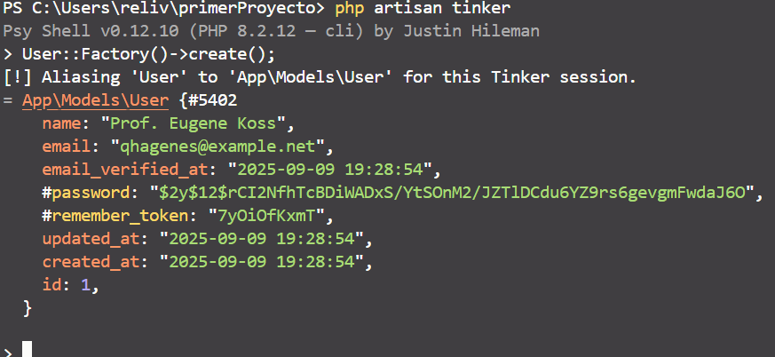
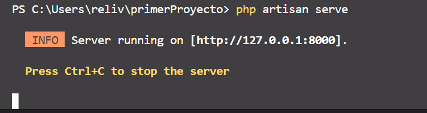

# Integracion continua de proyectos
70% proyecto
30% tareas


el artissan tiene varios comandos utiles para desarrollar en laravel, como a  partir de las bases de datos ingresadas en el frame crear datos falsos

correr un servidor para no usar xampp

con el siguiente comando podemos ver todas las funciones
``` laravel
php artisan
```

ciclo de vida laravel

peticion HTTP>index.php > framework > middleware(precarga) > rutas > middleware(especifico) > controlador > respuesta