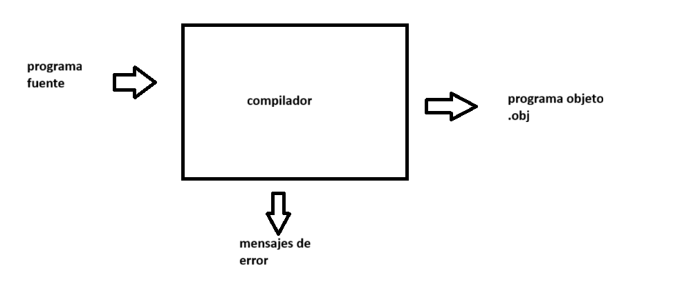

# lenguajes y automatas

resumen: 
-   alfabeto (Σ) es un conjunto de simbolos, desde 2,como el binario, hasta más
- cadena(W): conjunto de caracteres, que pueden incluir vacío (λ)
- lenguaje(L): convenciones de caracteres para habar

los lenguajes se subdividen en natural y formal, donde vemos los siguientes divisiones

natural 
- fonemas(como suenan las palabras)
    - pata
    - mata
    - lata
- morfologia(la forma que se estructuran las palabras)
    - *geo*(tierra) grafia(descripcion)
    - *bio*(vida)logia(estudio)
    - *filo*(saber)sofia(amante)
    - *alfa* *beto*(2 primeras letras del abecedario latin)
    - significado
    - sintaxis(orden)

formal
- lexico: el verificar que las palabras coincidan con el lenguaje
- sintaxis: orden que llevan las oraciones
    - print("hola mundo")
- semántica: interpretar la sintaxis para tener un resultado

## lenguajes de programacion
se dividen en lenguaje maquina, bajo nivel y alto nivel

## compilador

### estructura y fases de un compilador

### estructura de un traductor

el traductor está inmerso en el proceso de compilacion

### interprete
se ejecuta en el analizador lexico

