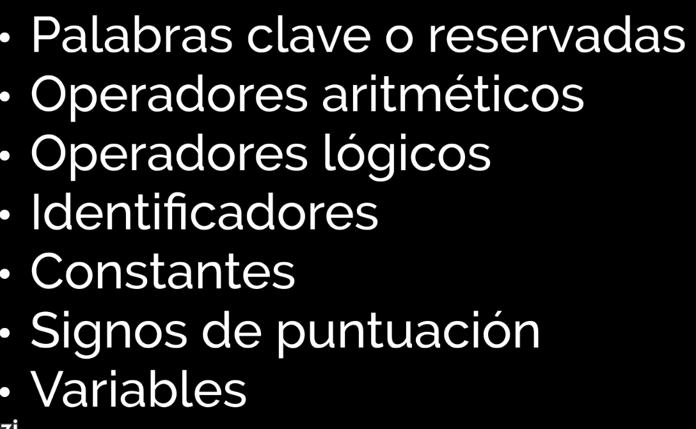
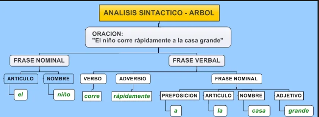

conclusión debate: 
- mejor lenguaje: los lenguajes hibridos como java obtienen en mi perspectiva lo mejor de ambos mundos: rapidez, portabilidad y versatilidad

- mejores casos para usar cada uno: para los compilados cuando es critico lograr un rendimiento excelente y será desarrollado por gente especializada; para los interpretados cuando se necesita rapidez de aprendizaje del lenguaje y de desarrollo, ademas de hacer portable el programa entre diferentes sistemas; y los hibridos para un poco de ambos.

# Lenguajes y automatas
## unidad 1
### analisis lexico
escanea los simbolos, reconoce las palabras y los divide en tokens(palabras clave, identificadores y simbolos), de este analisis sale un flujo de tokens

### analisis sintactico(parsing)
Del flujo de tokens que resulta del analisis lexico, arma un arbol sintactico para verificar sintaxis, prioridades y demas

### analisis semantico
verifica que el codigo tiene sentido, asegurandose de que los tipos de datos sean compatibles, las variables estén declaradas y las funciones sean llamadas correctamente. Se enfoca en verificar que el codigo fuente cumpla con las reglas y restricciones semanticas del lenguaje de programacion.

#### tipos de errores en el analisis
- un error lexico ocurre cuando el codigo contiene caracteres o simbolos no reconocidos por el lenguaje
- un error sintactico ocurre cuando el codigo viola la gramatica del lenguaje
- un error semantico ocurre cuando el codigo es sintacticamente correcto pero su significado no tiene sentido logico
