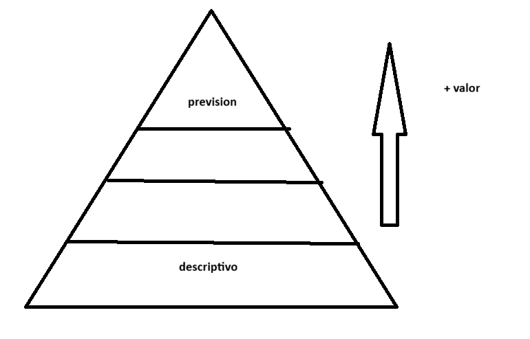

# Ciencia de datos
## ponderacion
- 20% asistencia 

## unidad 1
### dato
un dato es un simbolo o conjunto de simbolos que pueden ser usados para generar alguna representacion, la semiotica es la disciplina encargada de estudiarlos

pueden provenir de: 
- Bases de datos
- Archivos (CSV, Excel)
- Sensores
- Redes sociales
- Sistemas academicos o empresariales

independientemente del origen, los datos por si solos dicen nada. Primero necesitamos comprender el problema real, el entorno de los datos y el impacto que tienen en las decisiones **los datos no se analizan en el vacío**

Si no entendemos a profundidad el problema, aunque diseñemos de manera excelente el modelo puede que no sea optimo para las necesidades o puede que los resultados se interpreten en un enfoque erroneo.

### Ciencia de datos
La ciencia de datos convierte datos crudos en conocimiento accionable, es decir, que nos permita tomar decisiones o ejecutar en automatico tareas. d

La ciencia de datos es el conjunto de metodos, procesos y sistemas que permiten **recoletar, limpiar, analizar, modelar e interpretar grandes volumenes de datos** estructurados y no estructurados con el fin de generar conocimiento, predicciones y apoyo a la toma de decisiones.

### roles en la ciencia de datos
#### analista de datos
interpreta datos historicos para responder preguntas de negocio y crear reportes visuales, Está mas inclinado al lado de negocio que tecnico. Necesita habilidades tecnicas como: 
- SQL intermedio
- Excel avanzado
- herramientas BI (power BI/tableaw)
- Python o basico(pandas/matplotlib)
- estadistica descriptiva
#### cientifico de datos
crear modelos predictivos y realizar experimentos estadisticos para resolver problemas complejos, este rol está mas inclinado al. Necesita habilidades tecnicas como:
- Python o R
- Machine learning(scikit-learn)
- estadistica avanzada
- SQL
- Manejo de notebooks(jupyter)
- Algebra lineal
#### ingeniero de datos
construir y mantener las tuberias(pipelines) que transportan y transforman los datos del origen al destino, prerara los datos para como se van a trabajar. Necesita habilidades tecnicas como:
- SQL profundo
- Python orientado a objetos
- Spark/hadoop
- Gestion de APIs
- Cloud(AWS/Azure/GCP)
- NoSQL
- Herramientas ETL(Extraer, transformar y cargar datos)

**investigar sobre funcion lambda AWS
#### ingeniero de Machine learning
Dsplegar los modelos del cientifico de datos en produccion y asegurar que funcionen a gran escala, este rol esta inclinado mas a TI.Necesita habilidades tecnicas como:
- Python avanzado(software engineering)
- Docker, kubernetes
- MLOPS
- Frameworks de deep learning(pytorch/tensorFlow)
- CI/CD

#### arquitecto de datos
diseñar la infraestructura general de los sistemas de datos y como se integran las bases de datos de una empresa, inclinado mas a TI. Necesita habilidades tecnicas como:
- Diseño de base de datos
- Modelado de datos
- Gobernanza de datos
- seguridad informatica
- estrategia de almacenamiento en la nube

#### desarrollador de BI
Transformar datos crudos en tableros de control(dashboards) automatizados y optimizar consultas de negocio, inclinado mas a TI.Necesita habilidades tecnicas como:
- SQL avanzado
- DAX o Power Query
- Herramientas BI
- almacenamiento de datos(Data Warehousing)
- Modelado de datos en estrella

A la hora de empezar a trabajar con los datos de una empresa, hay un orden de prioridad/piramide de maslow de valor en los cientificos de datos, para ir progresando de la descripcion a las previsiones.

